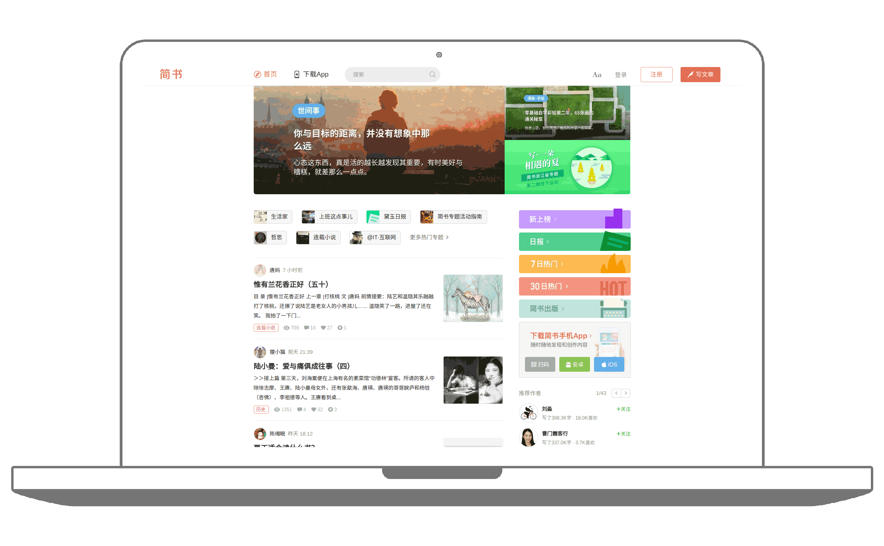

<p align="center">
	
</p>

<p align="center">
	<b>Refactoring Jianshu with Angular</b>
</p>

<p align="center">
	<a href="https://travis-ci.org/jeneser/jianshu"></a>
	<a href="https://github.com/jeneser/jianshu/blob/master/package.json"></a>
	<a href="https://www.codacy.com/app/jeneser/jianshu?utm_source=github.com&amp;utm_medium=referral&amp;utm_content=jeneser/jianshu&amp;utm_campaign=Badge_Grade"></a>
	<a href=""></a>
	<a href="http://isitmaintained.com/project/jeneser/jianshu"></a>
	<a href="http://isitmaintained.com/project/jeneser/jianshu"></a>
	<a href="https://github.com/jeneser/jianshu/pulls"></a>
	<a href="https://github.com/jeneser/jianshu/blob/master/LICENSE"></a>
</p>

<br>
<p align="center">
	
	<br><br>
	<strong>......</strong>
	<br>
	<strong><a href="">Live Demo</a></strong>
</p>
<br>

## Build Setup

``` bash
# install dependencies
npm install

# serve with hot reload at localhost:4200
ng serve

# build for production
ng build --prod

```

For detailed explanation on how things work, checkout the [docs for angular-cli](https://github.com/angular/angular-cli).

## Change log

- July 10, 2017:
  - Refactoring theme and style
  - Update README

## License

[MIT](https://github.com/jeneser/JIANSHU/blob/master/LICENSE) Copyright (c) 2017 Jeneser
